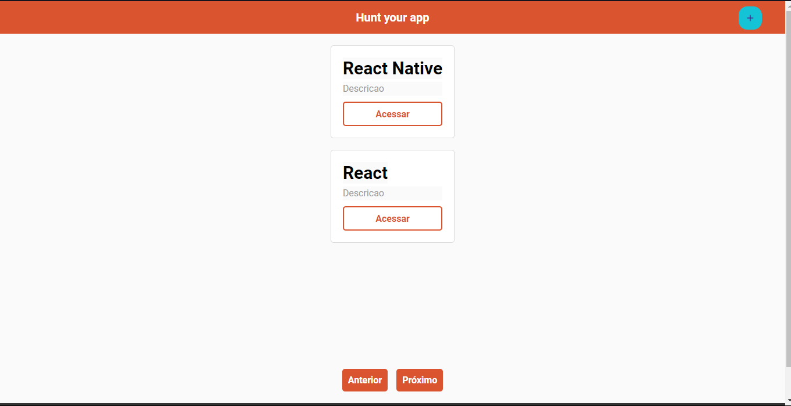

<div align="center">

# Hunt ☀

</div>

<p align="center">
  A clone of Product Hunt, result of Starter from Rocketseat.
</p>

<div align="center">

  [](https://github.com/styled-components/styled-components)

  

</div>

---

## How to run and contribute 🤔

```
# Clone repository

$ git clone https://github.com/r3nanp/hunt.git
```

```
# Run this command at root of directory

$ yarn or npm run install
```

### How to Fork the project 💪

```
# Create a new branch with your changes:

$ git checkout -b <branch>
```

```
# Save your changes and create a commit message telling you what you did:

$ git commit -m "<commit>"
```

```
# Submit your changes:

$ git push origin <branch>
```
---

## Local settings

```
# To run the app in your machine:

$ yarn start or npm run start
```

```
# To build the app:

$ yarn build or npm run build
```

#### Screenshot



---
